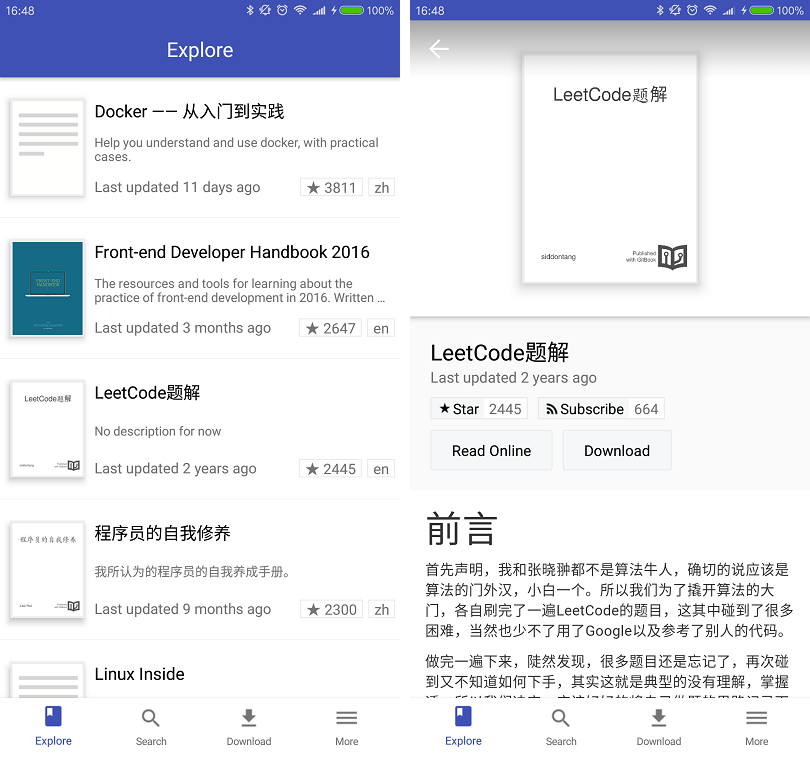

## GitBook阅读器

使用ReactNative开发的GitBook阅读器，可以查看在线的书籍信息，在线阅读和下载。

目前仅适配了Android端，iOS适配中。

### Android版本下载

### 截屏

### 主要功能

- 展示流行的书籍列表
- 搜索功能
- 在线阅读
- 下载书籍，本地阅读（保持和在线一样的样式）
- 扫描gitbook在线网址的二维码，获得书籍信息

### 开发进度

- [x] Explore页面，根据Star显示流行的书籍列表
- [x] 搜索功能
- [x] 下载功能
- [x] 本地阅读器
- [x] 扫描gitbook在线网址的二维码，获得书籍信息
- [x] 本地阅读器功能丰富: 保存、恢复阅读滚动条进度
- [ ] Explore页面过滤、排序功能
- [ ] 搜索结果过滤、排序功能
- [ ] 本地阅读器功能丰富（收藏、更改字体、night模式）
- [ ] 使用Redux
- [ ] test

### 数据来源

- [Gitbook API](https://developer.gitbook.com)

- [在线搜索页面](https://www.gitbook.com/search?q=react) 搜索功能没有API，采用了解析html结果的方式

### 使用的第三方依赖

- [react-native-navigation](https://github.com/wix/react-native-navigation/)
- [react-native-interactable](https://github.com/wix/react-native-interactable)
- [react-native-fs](https://github.com/itinance/react-native-fs)
- [realm](https://realm.io/news/introducing-realm-react-native/)
